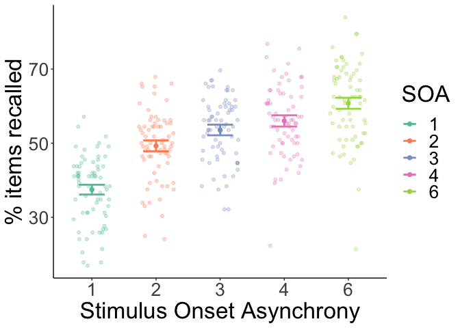
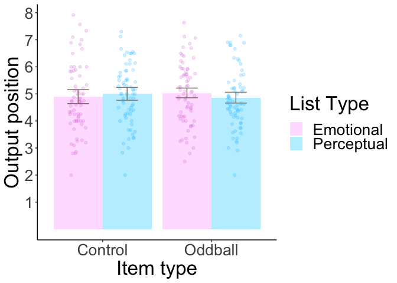
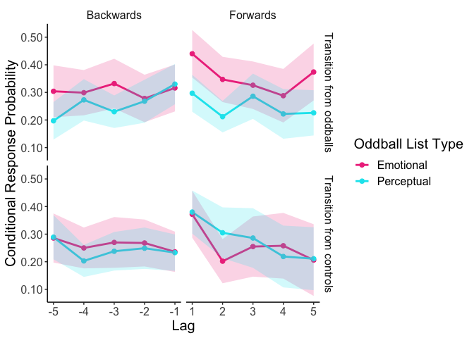
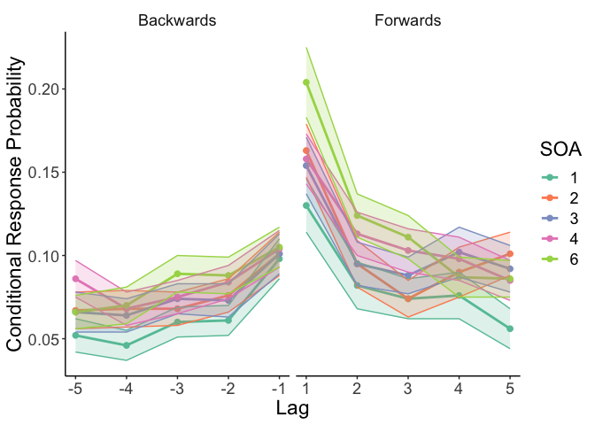
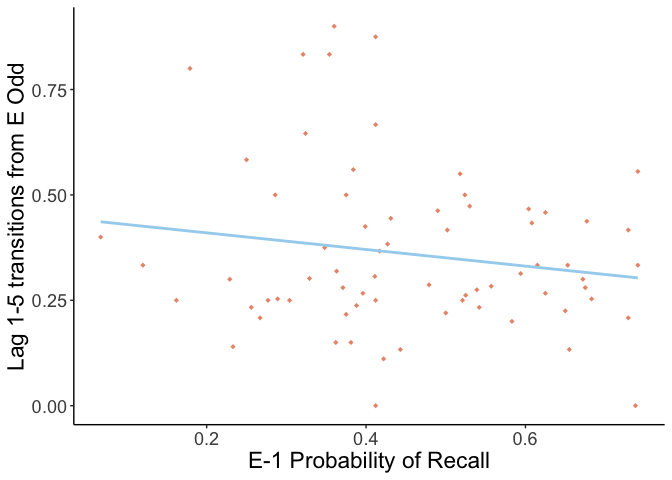

Emotional salience modulates the forward flow of memory
================
Peris-Yague et al. 2021
8/17/2021

Shield: [![CC BY-NC-SA 4.0][cc-by-nc-sa-shield]][cc-by-nc-sa]

This work is licensed under a
[Creative Commons Attribution-NonCommercial-ShareAlike 4.0 International License][cc-by-nc-sa].

[![CC BY-NC-SA 4.0][cc-by-nc-sa-image]][cc-by-nc-sa]

[cc-by-nc-sa]: http://creativecommons.org/licenses/by-nc-sa/4.0/
[cc-by-nc-sa-image]: https://licensebuttons.net/l/by-nc-sa/4.0/88x31.png
[cc-by-nc-sa-shield]: https://img.shields.io/badge/License-CC%20BY--NC--SA%204.0-lightgrey.svg

  - [Fig. 1C Relative Recall Position by
    SOA](#fig-1c-relative-recall-position-by-soa)
  - [Fig. 1D Amount of items recalled per
    SOA](#fig-1d-amount-of-items-recalled-per-soa)
  - [Fig. 2A Conditional Response Probability
    Curves](#fig-2a-conditional-response-probability-curves)
  - [Fig. 2B Conditional Response Probability Curves by Stimulus Onset
    Asynchrony](#fig-2b-conditional-response-probability-curves-by-stimulus-onset-asynchrony)
  - [Fig. 3C Conditional Response Probability Curves transitions
    ***to*** and ***from***
    oddballs](#fig-3c-conditional-response-probability-curves-transitions-to-and-from-oddballs)
  - [Fig. 4 Condutional Response Probability Curves by SOA transitions
    ***to*** and ***from***
    oddballs](#fig-4-condutional-response-probability-curves-by-soa-transitions-to-and-from-oddballs)
  - [***Supplementary Material
    Analyses***](#supplementary-material-analyses)
  - [Fig. S1 Conditional Response Probability Curves in remembered
    vs. forgotten
    oddballs](#fig-s1-conditional-response-probability-curves-in-remembered-vs-forgotten-oddballs)
  - [Fig. S2 Normalized Recall](#fig-s2-normalized-recall)
  - [Fig. S3 E-1, lag+1 correlation](#fig-s3-e-1-lag1-correlation)

To preprocess the raw data and re-organize the data run:

  - v1SOA\_preprocessing\_alldata
  - v1SOA\_preprocessing\_CRP

This will create output matrices that will be saved in the code folder
and later called for the analyses.

You must also download this toolbox:
<http://memory.psych.upenn.edu/Behavioral_toolbox> Some of the analyses
use functions from the toolbox, for which, the path in Matlab must be
changed.

The following scripts allow you to obtain the results. The raw results
will be .csv files which are saved in Raw\_Results and will later be
used in an R notebook to run the statistics and obtain the figures.

  
  - CRP\_lag\_analyses.m (CRP lag curve analyses)
  - probability_recall.m (probability of recall)
  - check_encoding_recall.m (find when the oddballs and controls were recalled)
  - list_recall_SOA.m (calculate how many items are recalled per list per SOA)
  - CRP_lag_analyses_controlwords.m (CRP analyses for control items)
  - CRP_lag_analyses_bySOA.m (CRP lag curves by SOA)

Once the above scripts have all been run, to obtain the statistical
results and the figures run the following R markdown in the ‘Results’
folder.

  - stats\_figures.Rmd

# Fig. 1C Relative Recall Position by SOA

<!-- -->

# Fig. 1D Amount of items recalled per SOA

<!-- -->

    ## ANOVA Table (type III tests)
    ## 
    ##   Effect  DFn   DFd       F        p p<.05  ges
    ## 1    SOA 3.35 231.4 136.881 2.47e-54     * 0.41

# Fig. 2A Conditional Response Probability Curves

<!-- -->

    ## ANOVA Table (type III tests)
    ## 
    ##                               Effect  DFn    DFd       F        p p<.05
    ## 1                        oddballtype 1.00  69.00   4.068 4.80e-02     *
    ## 2                       wordposition 2.95 203.77 105.011 9.51e-41     *
    ## 3                          direction 1.00  69.00   1.614 2.08e-01      
    ## 4           oddballtype:wordposition 4.00 276.00   0.932 4.46e-01      
    ## 5              oddballtype:direction 1.00  69.00   0.252 6.17e-01      
    ## 6             wordposition:direction 3.06 210.95  13.583 3.07e-08     *
    ## 7 oddballtype:wordposition:direction 4.00 276.00   0.538 7.08e-01      
    ##        ges
    ## 1 0.001000
    ## 2 0.268000
    ## 3 0.001000
    ## 4 0.002000
    ## 5 0.000152
    ## 6 0.044000
    ## 7 0.002000

    ## # A tibble: 20 × 11
    ##    direction .y.   group1 group2    n1    n2 statistic    df        p    p.adj
    ##  * <fct>     <chr> <chr>  <chr>  <int> <int>     <dbl> <dbl>    <dbl>    <dbl>
    ##  1 Backwards x     1      2         70    70     5.97     69 9.22e- 8 2.3 e- 7
    ##  2 Backwards x     1      3         70    70     6.33     69 2.09e- 8 6.97e- 8
    ##  3 Backwards x     1      4         70    70     9.00     69 2.98e-13 2.98e-12
    ##  4 Backwards x     1      5         70    70     6.74     69 3.91e- 9 1.96e- 8
    ##  5 Backwards x     2      3         70    70     0.861    69 3.92e- 1 4.36e- 1
    ##  6 Backwards x     2      4         70    70     3.24     69 2   e- 3 4   e- 3
    ##  7 Backwards x     2      5         70    70     1.36     69 1.79e- 1 2.24e- 1
    ##  8 Backwards x     3      4         70    70     2.19     69 3.2 e- 2 5.4 e- 2
    ##  9 Backwards x     3      5         70    70     0.573    69 5.68e- 1 5.68e- 1
    ## 10 Backwards x     4      5         70    70    -1.99     69 5   e- 2 7.2 e- 2
    ## 11 Forwards  x     1      2         70    70     8.96     69 3.56e-13 8.9 e-13
    ## 12 Forwards  x     1      3         70    70    11.7      69 4.94e-18 2.47e-17
    ## 13 Forwards  x     1      4         70    70    11.1      69 5.47e-17 1.82e-16
    ## 14 Forwards  x     1      5         70    70    13.0      69 2.88e-20 2.88e-19
    ## 15 Forwards  x     2      3         70    70     3.83     69 2.81e- 4 4.01e- 4
    ## 16 Forwards  x     2      4         70    70     4.18     69 8.36e- 5 1.39e- 4
    ## 17 Forwards  x     2      5         70    70     7.07     69 9.91e-10 1.98e- 9
    ## 18 Forwards  x     3      4         70    70     0.464    69 6.44e- 1 6.44e- 1
    ## 19 Forwards  x     3      5         70    70     3.42     69 1   e- 3 1   e- 3
    ## 20 Forwards  x     4      5         70    70     2.89     69 5   e- 3 6   e- 3
    ## # … with 1 more variable: p.adj.signif <chr>

    ## # A tibble: 20 × 8
    ##    .y.   group1 group2 effsize direction    n1    n2 magnitude 
    ##  * <chr> <chr>  <chr>    <dbl> <fct>     <int> <int> <ord>     
    ##  1 x     1      2       0.714  Backwards    70    70 moderate  
    ##  2 x     1      3       0.757  Backwards    70    70 moderate  
    ##  3 x     1      4       1.08   Backwards    70    70 large     
    ##  4 x     1      5       0.806  Backwards    70    70 large     
    ##  5 x     2      3       0.103  Backwards    70    70 negligible
    ##  6 x     2      4       0.387  Backwards    70    70 small     
    ##  7 x     2      5       0.162  Backwards    70    70 negligible
    ##  8 x     3      4       0.261  Backwards    70    70 small     
    ##  9 x     3      5       0.0685 Backwards    70    70 negligible
    ## 10 x     4      5      -0.238  Backwards    70    70 small     
    ## 11 x     1      2       1.07   Forwards     70    70 large     
    ## 12 x     1      3       1.40   Forwards     70    70 large     
    ## 13 x     1      4       1.33   Forwards     70    70 large     
    ## 14 x     1      5       1.56   Forwards     70    70 large     
    ## 15 x     2      3       0.458  Forwards     70    70 small     
    ## 16 x     2      4       0.500  Forwards     70    70 small     
    ## 17 x     2      5       0.845  Forwards     70    70 large     
    ## 18 x     3      4       0.0555 Forwards     70    70 negligible
    ## 19 x     3      5       0.408  Forwards     70    70 small     
    ## 20 x     4      5       0.346  Forwards     70    70 small

    ## # A tibble: 5 × 11
    ##   wordposition .y.   group1    group2    n1    n2 statistic    df       p   p.adj
    ## * <fct>        <chr> <chr>     <chr>  <int> <int>     <dbl> <dbl>   <dbl>   <dbl>
    ## 1 1            x     Backwards Forwa…    70    70    -4.64     69 1.62e-5 1.62e-5
    ## 2 2            x     Backwards Forwa…    70    70    -1.06     69 2.91e-1 2.91e-1
    ## 3 3            x     Backwards Forwa…    70    70     1.93     69 5.7 e-2 5.7 e-2
    ## 4 4            x     Backwards Forwa…    70    70    -0.308    69 7.59e-1 7.59e-1
    ## 5 5            x     Backwards Forwa…    70    70     3.90     69 2.19e-4 2.19e-4
    ## # … with 1 more variable: p.adj.signif <chr>

    ## # A tibble: 5 × 8
    ##   .y.   group1    group2   effsize wordposition    n1    n2 magnitude 
    ## * <chr> <chr>     <chr>      <dbl> <fct>        <int> <int> <ord>     
    ## 1 x     Backwards Forwards -0.554  1               70    70 moderate  
    ## 2 x     Backwards Forwards -0.127  2               70    70 negligible
    ## 3 x     Backwards Forwards  0.231  3               70    70 small     
    ## 4 x     Backwards Forwards -0.0369 4               70    70 negligible
    ## 5 x     Backwards Forwards  0.466  5               70    70 small

# Fig. 2B Conditional Response Probability Curves by Stimulus Onset Asynchrony

<!-- -->

    ## ANOVA Table (type III tests)
    ## 
    ##   Effect DFn DFd     F     p p<.05   ges
    ## 1    SOA   4 276 31.17 2e-21     * 0.231

    ## # A tibble: 10 × 10
    ##    .y.   group1 group2    n1    n2 statistic    df        p    p.adj
    ##  * <chr> <chr>  <chr>  <int> <int>     <dbl> <dbl>    <dbl>    <dbl>
    ##  1 x     1      2         70    70    -5.18     69 2.07e- 6 4.14e- 6
    ##  2 x     1      3         70    70    -5.68     69 2.95e- 7 9.83e- 7
    ##  3 x     1      4         70    70    -7.68     69 7.64e-11 3.82e-10
    ##  4 x     1      6         70    70   -10.8      69 1.76e-16 1.76e-15
    ##  5 x     2      3         70    70    -0.442    69 6.6 e- 1 6.6 e- 1
    ##  6 x     2      4         70    70    -1.97     69 5.3 e- 2 6.6 e- 2
    ##  7 x     2      6         70    70    -5.24     69 1.64e- 6 4.1 e- 6
    ##  8 x     3      4         70    70    -1.50     69 1.37e- 1 1.52e- 1
    ##  9 x     3      6         70    70    -4.70     69 1.27e- 5 2.12e- 5
    ## 10 x     4      6         70    70    -3.51     69 8   e- 4 1   e- 3
    ## # … with 1 more variable: p.adj.signif <chr>

    ## # A tibble: 10 × 7
    ##    .y.   group1 group2 effsize    n1    n2 magnitude 
    ##  * <chr> <chr>  <chr>    <dbl> <int> <int> <ord>     
    ##  1 x     1      2      -0.619     70    70 moderate  
    ##  2 x     1      3      -0.679     70    70 moderate  
    ##  3 x     1      4      -0.918     70    70 large     
    ##  4 x     1      6      -1.29      70    70 large     
    ##  5 x     2      3      -0.0529    70    70 negligible
    ##  6 x     2      4      -0.235     70    70 small     
    ##  7 x     2      6      -0.627     70    70 moderate  
    ##  8 x     3      4      -0.180     70    70 negligible
    ##  9 x     3      6      -0.562     70    70 moderate  
    ## 10 x     4      6      -0.419     70    70 small

# Fig. 3C Conditional Response Probability Curves transitions ***to*** and ***from*** oddballs

<!-- -->

    ## ANOVA Table (type III tests)
    ## 
    ##                             Effect DFn DFd      F        p p<.05   ges
    ## 1                      oddballtype   1  69 12.446 0.000750     * 0.014
    ## 2                        direction   1  69  2.458 0.122000       0.006
    ## 3                       transition   1  69  6.872 0.011000     * 0.012
    ## 4            oddballtype:direction   1  69  1.121 0.293000       0.002
    ## 5           oddballtype:transition   1  69 15.387 0.000204     * 0.021
    ## 6             direction:transition   1  69  7.473 0.008000     * 0.014
    ## 7 oddballtype:direction:transition   1  69  0.641 0.426000       0.002

    ## # A tibble: 2 × 11
    ##   oddballtype .y.   group1 group2    n1    n2 statistic    df         p    p.adj
    ## * <fct>       <chr> <chr>  <chr>  <int> <int>     <dbl> <dbl>     <dbl>    <dbl>
    ## 1 E           x     from   to        70    70     4.41     69 0.0000373  3.73e-5
    ## 2 P           x     from   to        70    70    -0.731    69 0.467      4.67e-1
    ## # … with 1 more variable: p.adj.signif <chr>

    ## # A tibble: 2 × 8
    ##   .y.   group1 group2 effsize oddballtype    n1    n2 magnitude 
    ## * <chr> <chr>  <chr>    <dbl> <fct>       <int> <int> <ord>     
    ## 1 x     from   to      0.527  E              70    70 moderate  
    ## 2 x     from   to     -0.0874 P              70    70 negligible

    ## # A tibble: 2 × 11
    ##   direction .y.   group1 group2    n1    n2 statistic    df         p     p.adj
    ## * <fct>     <chr> <chr>  <chr>  <int> <int>     <dbl> <dbl>     <dbl>     <dbl>
    ## 1 backwards x     from   to        70    70    -0.172    69 0.864     0.864    
    ## 2 forwards  x     from   to        70    70     4.21     69 0.0000762 0.0000762
    ## # … with 1 more variable: p.adj.signif <chr>

    ## # A tibble: 2 × 8
    ##   .y.   group1 group2 effsize direction    n1    n2 magnitude 
    ## * <chr> <chr>  <chr>    <dbl> <fct>     <int> <int> <ord>     
    ## 1 x     from   to     -0.0206 backwards    70    70 negligible
    ## 2 x     from   to      0.503  forwards     70    70 moderate

# Fig. 4 Condutional Response Probability Curves by SOA transitions ***to*** and ***from*** oddballs

<!-- -->

    ## # A tibble: 1 × 7
    ##   .y.   group1 group2    n1    n2 statistic         p
    ## * <chr> <chr>  <chr>  <int> <int>     <dbl>     <dbl>
    ## 1 mean  from   to        70    70      1965 0.0000239

    ## # A tibble: 1 × 7
    ##   .y.   group1 group2 effsize    n1    n2 magnitude
    ## * <chr> <chr>  <chr>    <dbl> <int> <int> <ord>    
    ## 1 mean  from   to       0.505    70    70 large

# ***Supplementary Material Analyses***

# Fig. S1 Conditional Response Probability Curves in remembered vs. forgotten oddballs

<!-- -->

# Fig. S2 Normalized Recall

    ## ANOVA Table (type III tests)
    ## 
    ##                     Effect DFn DFd      F        p p<.05   ges
    ## 1              oddballtype   1  69  3.477 6.60e-02       0.014
    ## 2             wordposition   3 207 55.100 3.19e-26     * 0.129
    ## 3 oddballtype:wordposition   3 207  3.604 1.40e-02     * 0.010

    ## # A tibble: 6 × 10
    ##   .y.   group1 group2    n1    n2 statistic    df        p    p.adj p.adj.signif
    ## * <chr> <chr>  <chr>  <int> <int>     <dbl> <dbl>    <dbl>    <dbl> <chr>       
    ## 1 x     m1     m2        70    70   -1.17      69 2.47e- 1 3.13e- 1 ns          
    ## 2 x     m1     odd       70    70  -10.3       69 1.56e-15 4.68e-15 ****        
    ## 3 x     m1     p1        70    70    0.0908    69 9.28e- 1 9.28e- 1 ns          
    ## 4 x     m2     odd       70    70   -9.61      69 2.35e-14 4.7 e-14 ****        
    ## 5 x     m2     p1        70    70    1.13      69 2.61e- 1 3.13e- 1 ns          
    ## 6 x     odd    p1        70    70   11.2       69 3.64e-17 2.18e-16 ****

    ## # A tibble: 6 × 7
    ##   .y.   group1 group2 effsize    n1    n2 magnitude 
    ## * <chr> <chr>  <chr>    <dbl> <int> <int> <ord>     
    ## 1 x     m1     m2     -0.139     70    70 negligible
    ## 2 x     m1     odd    -1.23      70    70 large     
    ## 3 x     m1     p1      0.0109    70    70 negligible
    ## 4 x     m2     odd    -1.15      70    70 large     
    ## 5 x     m2     p1      0.135     70    70 negligible
    ## 6 x     odd    p1      1.34      70    70 large

    ## # A tibble: 4 × 11
    ##   wordposition .y.     group1 group2    n1    n2 statistic    df       p   p.adj
    ## * <fct>        <chr>   <chr>  <chr>  <int> <int>     <dbl> <dbl>   <dbl>   <dbl>
    ## 1 m1           normrec E      P         70    70     0.783    69 4.36e-1 4.36e-1
    ## 2 m2           normrec E      P         70    70     0.527    69 6   e-1 6   e-1
    ## 3 odd          normrec E      P         70    70     3.93     69 1.99e-4 1.99e-4
    ## 4 p1           normrec E      P         70    70     0.878    69 3.83e-1 3.83e-1
    ## # … with 1 more variable: p.adj.signif <chr>

    ## # A tibble: 4 × 8
    ##   .y.     group1 group2 effsize wordposition    n1    n2 magnitude 
    ## * <chr>   <chr>  <chr>    <dbl> <fct>        <int> <int> <ord>     
    ## 1 normrec E      P       0.0936 m1              70    70 negligible
    ## 2 normrec E      P       0.0630 m2              70    70 negligible
    ## 3 normrec E      P       0.470  odd             70    70 small     
    ## 4 normrec E      P       0.105  p1              70    70 negligible

<!-- -->

    ## # A tibble: 1 × 10
    ##   .y.    group1 group2    n1    n2 statistic    df     p p.adj p.adj.signif
    ## * <chr>  <chr>  <chr>  <int> <int>     <dbl> <dbl> <dbl> <dbl> <chr>       
    ## 1 recall em1    ce        70    70     -1.07    69  0.29  0.29 ns

    ## # A tibble: 1 × 7
    ##   .y.    group1 group2 effsize    n1    n2 magnitude 
    ## * <chr>  <chr>  <chr>    <dbl> <int> <int> <ord>     
    ## 1 recall em1    ce      -0.128    70    70 negligible

# Fig. S3 E-1, lag+1 correlation

<!-- -->

    ## 
    ##  Spearman's rank correlation rho
    ## 
    ## data:  corrplot$V1 and corrplot$V2
    ## S = 47491, p-value = 0.7648
    ## alternative hypothesis: true rho is not equal to 0
    ## sample estimates:
    ##         rho 
    ## -0.03782232
