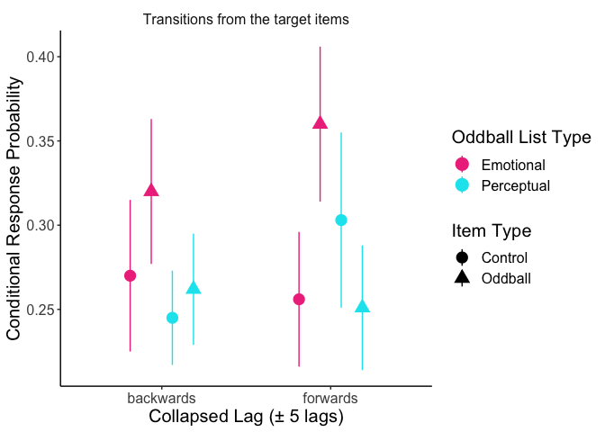
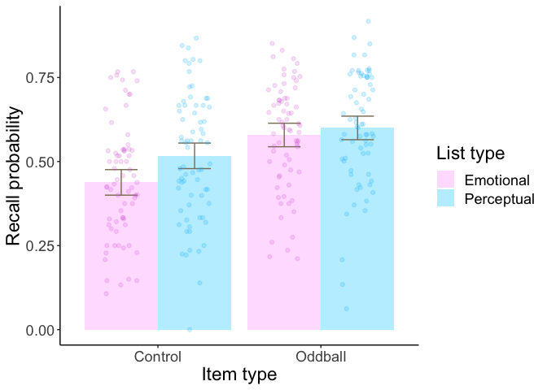

Emotional salience modulates the forward flow of memory
================
Peris-Yague et al. 2021
8/17/2021

  - [***Manuscript Figures and
    Analyses***](#manuscript-figures-and-analyses)
  - [Fig. 1C- Amount of items recalled per
    SOA](#fig-1c--amount-of-items-recalled-per-soa)
  - [Fig. 1D- Oddballs vs controls output
    position](#fig-1d--oddballs-vs-controls-output-position)
  - [Fig. 2C- 2D To vs from transitions from oddball
    items](#fig-2c--2d-to-vs-from-transitions-from-oddball-items)
  - [***Supplementary Material Figures and
    Analyses***](#supplementary-material-figures-and-analyses)
  - [Fig. S1A,S1B, Table S1- Recall
    probability](#fig-s1as1b-table-s1--recall-probability)
  - [Fig. S2A Conditional Response Probability
    Curves](#fig-s2a-conditional-response-probability-curves)
  - [Fig. S2B Conditional Response Probability Curves by Stimulus Onset
    Asynchrony](#fig-s2b-conditional-response-probability-curves-by-stimulus-onset-asynchrony)
  - [Fig. S3- Correlation of lag + 1 from emotional oddballs with E-1
    recall](#fig-s3--correlation-of-lag--1-from-emotional-oddballs-with-e-1-recall)
  - [Output for JASP in table S3, S4, S5- recall probability by SOA
    (view
    code)](#output-for-jasp-in-table-s3-s4-s5--recall-probability-by-soa-view-code)
  - [Table S6- Emotional ratings](#table-s6--emotional-ratings)
  - [Table S7- Semantic ratings](#table-s7--semantic-ratings)

# ***Manuscript Figures and Analyses***

# Fig. 1C- Amount of items recalled per SOA

<!-- -->

# Fig. 1D- Oddballs vs controls output position

<!-- -->

    ## # A tibble: 1 × 4
    ##     df1   df2 statistic     p
    ##   <int> <int>     <dbl> <dbl>
    ## 1     3   275     0.586 0.625

    ## ANOVA Table (type III tests)
    ## 
    ##           Effect DFn DFd     F     p p<.05      ges
    ## 1      list_type   1  68 0.006 0.937       1.66e-05
    ## 2           item   1  68 0.078 0.780       1.62e-04
    ## 3 list_type:item   1  68 2.070 0.155       6.00e-03

# Fig. 2C- 2D To vs from transitions from oddball items

<!-- -->

    ## ANOVA Table (type III tests)
    ## 
    ##                            Effect DFn DFd      F        p p<.05   pes
    ## 1                     oddballtype   1  69  7.989 0.006000     * 0.104
    ## 2                       item_type   1  69  5.747 0.019000     * 0.077
    ## 3                       direction   1  69  1.215 0.274000       0.017
    ## 4           oddballtype:item_type   1  69 14.558 0.000293     * 0.174
    ## 5           oddballtype:direction   1  69  0.108 0.744000       0.002
    ## 6             item_type:direction   1  69  0.089 0.767000       0.001
    ## 7 oddballtype:item_type:direction   1  69  3.919 0.052000       0.054

    ## # A tibble: 4 × 12
    ##   oddballtype direction .y.     group1  group2    n1    n2 statistic    df     p
    ## * <fct>       <fct>     <chr>   <chr>   <chr>  <int> <int>     <dbl> <dbl> <dbl>
    ## 1 E           backwards CRPmean control oddba…    70    70    -1.85     69 0.068
    ## 2 E           forwards  CRPmean control oddba…    70    70    -3.23     69 0.002
    ## 3 P           backwards CRPmean control oddba…    70    70    -0.956    69 0.343
    ## 4 P           forwards  CRPmean control oddba…    70    70     1.73     69 0.088
    ## # … with 2 more variables: p.adj <dbl>, p.adj.signif <chr>

    ## # A tibble: 4 × 9
    ##   .y.     group1  group2  effsize oddballtype direction    n1    n2 magnitude 
    ## * <chr>   <chr>   <chr>     <dbl> <fct>       <fct>     <int> <int> <ord>     
    ## 1 CRPmean control oddball  -0.222 E           backwards    70    70 small     
    ## 2 CRPmean control oddball  -0.386 E           forwards     70    70 small     
    ## 3 CRPmean control oddball  -0.114 P           backwards    70    70 negligible
    ## 4 CRPmean control oddball   0.207 P           forwards     70    70 small

<!-- -->

    ## ANOVA Table (type III tests)
    ## 
    ##                  Effect DFn DFd      F        p p<.05   pes
    ## 1           oddballtype   1  69  2.675 0.106000       0.037
    ## 2             item_type   1  69  1.355 0.248000       0.019
    ## 3 oddballtype:item_type   1  69 12.213 0.000834     * 0.150

    ## # A tibble: 2 × 11
    ##   oddballtype .y.     group1  group2     n1    n2 statistic    df     p p.adj
    ## * <fct>       <chr>   <chr>   <chr>   <int> <int>     <dbl> <dbl> <dbl> <dbl>
    ## 1 E           CRPmean control oddball    70    70     -3.23    69 0.002 0.002
    ## 2 P           CRPmean control oddball    70    70      1.73    69 0.088 0.088
    ## # … with 1 more variable: p.adj.signif <chr>

    ## # A tibble: 2 × 8
    ##   .y.     group1  group2  effsize oddballtype    n1    n2 magnitude
    ## * <chr>   <chr>   <chr>     <dbl> <fct>       <int> <int> <ord>    
    ## 1 CRPmean control oddball  -0.386 E              70    70 small    
    ## 2 CRPmean control oddball   0.207 P              70    70 small

    ## ANOVA Table (type III tests)
    ## 
    ##                  Effect DFn DFd     F     p p<.05   pes
    ## 1           oddballtype   1  69 3.992 0.050     * 0.055
    ## 2             item_type   1  69 4.646 0.035     * 0.063
    ## 3 oddballtype:item_type   1  69 0.978 0.326       0.014

    ## # A tibble: 2 × 11
    ##   oddballtype .y.     group1  group2     n1    n2 statistic    df     p p.adj
    ## * <fct>       <chr>   <chr>   <chr>   <int> <int>     <dbl> <dbl> <dbl> <dbl>
    ## 1 E           CRPmean control oddball    70    70    -1.85     69 0.068 0.068
    ## 2 P           CRPmean control oddball    70    70    -0.956    69 0.343 0.343
    ## # … with 1 more variable: p.adj.signif <chr>

    ## # A tibble: 2 × 8
    ##   .y.     group1  group2  effsize oddballtype    n1    n2 magnitude 
    ## * <chr>   <chr>   <chr>     <dbl> <fct>       <int> <int> <ord>     
    ## 1 CRPmean control oddball  -0.222 E              70    70 small     
    ## 2 CRPmean control oddball  -0.114 P              70    70 negligible

# ***Supplementary Material Figures and Analyses***

# Fig. S1A,S1B, Table S1- Recall probability

<!-- -->

    ## # A tibble: 1 × 4
    ##     df1   df2 statistic     p
    ##   <int> <int>     <dbl> <dbl>
    ## 1     3   276      1.20 0.309

    ## ANOVA Table (type III tests)
    ## 
    ##           Effect DFn DFd      F        p p<.05   pes
    ## 1      list_type   1  69  5.316 2.40e-02     * 0.072
    ## 2           item   1  69 35.098 1.11e-07     * 0.337
    ## 3 list_type:item   1  69  2.038 1.58e-01       0.029

    ## # A tibble: 1 × 10
    ##   .y.   group1  group2     n1    n2 statistic    df           p   p.adj p.adj.signif
    ## * <chr> <chr>   <chr>   <int> <int>     <dbl> <dbl>       <dbl>   <dbl> <chr>       
    ## 1 mean  control oddball    70    70     -5.92    69 0.000000112 1.12e-7 ****

    ## # A tibble: 1 × 7
    ##   .y.   group1  group2  effsize    n1    n2 magnitude
    ## * <chr> <chr>   <chr>     <dbl> <int> <int> <ord>    
    ## 1 mean  control oddball  -0.708    70    70 moderate

    ## # A tibble: 1 × 10
    ##   .y.   group1    group2        n1    n2 statistic    df     p p.adj p.adj.signif
    ## * <chr> <chr>     <chr>      <int> <int>     <dbl> <dbl> <dbl> <dbl> <chr>       
    ## 1 mean  emotional perceptual    70    70     -2.30    69 0.024 0.024 *

    ## # A tibble: 1 × 7
    ##   .y.   group1    group2     effsize    n1    n2 magnitude
    ## * <chr> <chr>     <chr>        <dbl> <int> <int> <ord>    
    ## 1 mean  emotional perceptual  -0.275    70    70 small

<!-- -->

    ## # A tibble: 1 × 4
    ##     df1   df2 statistic     p
    ##   <int> <int>     <dbl> <dbl>
    ## 1    11   828     0.924 0.516

    ## ANOVA Table (type III tests)
    ## 
    ##                    Effect DFn DFd     F     p p<.05   pes
    ## 1               list_type   1  69 7.175 0.009     * 0.094
    ## 2                oddvctrl   1  69 1.882 0.175       0.027
    ## 3                    item   2 138 0.943 0.392       0.013
    ## 4      list_type:oddvctrl   1  69 0.594 0.444       0.009
    ## 5          list_type:item   2 138 0.255 0.776       0.004
    ## 6           oddvctrl:item   2 138 0.163 0.849       0.002
    ## 7 list_type:oddvctrl:item   2 138 0.567 0.569       0.008

    ## # A tibble: 1 × 10
    ##   .y.   group1    group2        n1    n2 statistic    df     p p.adj p.adj.signif
    ## * <chr> <chr>     <chr>      <int> <int>     <dbl> <dbl> <dbl> <dbl> <chr>       
    ## 1 mean  emotional perceptual    70    70     -2.68    69 0.009 0.009 **

    ## # A tibble: 1 × 7
    ##   .y.   group1    group2     effsize    n1    n2 magnitude
    ## * <chr> <chr>     <chr>        <dbl> <int> <int> <ord>    
    ## 1 mean  emotional perceptual  -0.320    70    70 small

# Fig. S2A Conditional Response Probability Curves

<!-- -->

# Fig. S2B Conditional Response Probability Curves by Stimulus Onset Asynchrony

<!-- -->

# Fig. S3- Correlation of lag + 1 from emotional oddballs with E-1 recall

<!-- -->

    ## 
    ##  Spearman's rank correlation rho
    ## 
    ## data:  corrplot$V1 and corrplot$V2
    ## S = 61954, p-value = 0.4895
    ## alternative hypothesis: true rho is not equal to 0
    ## sample estimates:
    ##         rho 
    ## -0.08396426

# Output for JASP in table S3, S4, S5- recall probability by SOA (view code)

# Table S6- Emotional ratings

    ## ANOVA Table (type III tests)
    ## 
    ##     Effect DFn DFd       F        p p<.05   pes
    ## 1 salience   1  14 390.957 1.26e-11     * 0.965

    ## # A tibble: 1 × 10
    ##   .y.   group1 group2     n1    n2 statistic    df        p    p.adj p.adj.signif
    ## * <chr> <chr>  <chr>   <int> <int>     <dbl> <dbl>    <dbl>    <dbl> <chr>       
    ## 1 mean  eodd   neutral    15    15     -19.8    14 1.26e-11 1.26e-11 ****

    ## # A tibble: 1 × 7
    ##   .y.   group1 group2  effsize    n1    n2 magnitude
    ## * <chr> <chr>  <chr>     <dbl> <int> <int> <ord>    
    ## 1 mean  eodd   neutral   -5.11    15    15 large

# Table S7- Semantic ratings

    ## ANOVA Table (type III tests)
    ## 
    ##    Effect DFn DFd      F        p p<.05   pes
    ## 1 oddtype   1  13 30.125 0.000104     * 0.699

    ## # A tibble: 1 × 10
    ##   .y.   group1    group2        n1    n2 statistic    df       p   p.adj p.adj.signif
    ## * <chr> <chr>     <chr>      <int> <int>     <dbl> <dbl>   <dbl>   <dbl> <chr>       
    ## 1 mean  emotional perceptual    14    14     -5.49    13 1.04e-4 1.04e-4 ***

    ## # A tibble: 1 × 7
    ##   .y.   group1    group2     effsize    n1    n2 magnitude
    ## * <chr> <chr>     <chr>        <dbl> <int> <int> <ord>    
    ## 1 mean  emotional perceptual   -1.47    14    14 large
